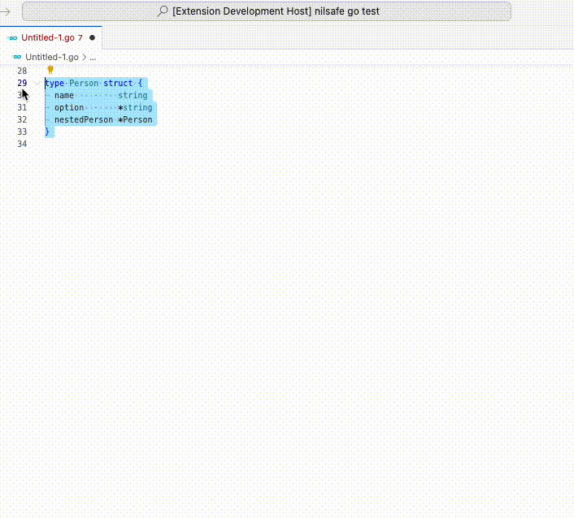

# Go getters and setters generator nilsafe (ggsgornil)

A VSCode extension to automatically generate getters (standard + nilsafe methods) and setters for struct fields.
- `GetName() string`
- `GetNameOrNil() *string` => allows (panic free) optional chaining 
- `SetName(name string) *Struct` => allows method chaining

A fork of [ggsg](https://github.com/trythrow/go-getters-setters-generator)
- Added support for nilsafe getters `GetNameOrNil() *string` => additional feature that allows (panic free) optional chaining
- Added support for imported packages `[]*time.Time` (bug fix)
- Added support for `[]*Struct` and `[]Struct` fields (bug fix)

## Features

This extension generates pointer receivers. Setters always return the struct pointer to allow method chaining. 

## How to use
1. Select a struct and some or all of its fields
2. `Shift+CMD+P` Select command & return

> Note: The first line in your selection should always be a struct declaration. The extension will only generate getters and setters for selected fields.

## Extension Settings

None at the moment

## Known Issues

None

## Release Notes

### 1.0.3
- Insert code below the struct declaration instead of EOF
- `// ## GENERATED - Getters & Setters for 'Invoice' ##` comment added above generated code
- `// ## END GENERATED - Getters & Setters for 'Invoice' ##` comment added below generated code

### 1.0.2
- Added support for nilsafe getters `GetNameOrNil() *string`
- Added support for imported packages `[]*time.Time`
- Added support for `[]*Struct` and `[]Struct` fields

### 1.0.0

Initial release of ggsgornil

**Hope you enjoy this extension!**
